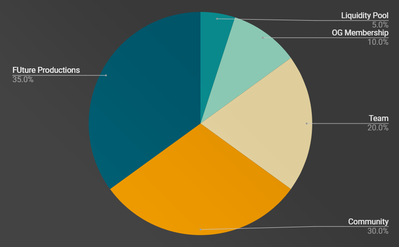

# FU Money ($FUM)

FU Money is what connects all FU Studios productions and supports the ecosystem. It has two main functions, <a href="#utility">**utility**</a> and <a href="#value-accrual">**value accrual**</a>. Inspired by EIP 1559 the utility function requires users to burn $FUM, this cements it as the base money for FU Studios.

## [Utility](#utility)

$FUM not only gives access to exclusive features to users but it can also be converted to a share of the revenue generated by all FU Studios productions.

### $FUM Burn Requirements

FU Studios productions will be required to support the FU Money economy by providing utility to the token if it makes sense for them to do so. The following are examples of token utility that could be added to productions:

#### Acquisition of extremely rare items and weapons

Extremely rare items can only be initially bought with FU Money. Since FU Money can be acquired in exchange for experience points, players that put in more time into the game have a greater chance of acquiring these items. Anyone that wants the item but has not put in the time required will need to support the FU Money economy in order to do so, benefiting the whole ecosystem.

#### Access to locked areas and special character upgrades

Access to locked areas with more experience points or character upgrades in the form of unique animations can be acquired by spending and burning FU Money.

#### Memberships

Anyone is able to mint a membership by burning FU Money. This automatically gives them the right to distribute Studio Passes and increase their chances of earning experience points.

## [Value Accrual](#value-accrual)

A percentage of the revenue generated by FU Studios productions is used to buy staked ETH and deposited into the treasury.
The staked ETH can be claimed by burning a relative share of $FUM. As users claim staked ETH the remaining $FUM holder’s share of the treasury increases.

# Token Distribution

### Max Supply

> 621,000,000

## Allocation

### OG Membership (5%)

Allocated to the Individuals who helped us build and launch Open Season and hold the [membership NFT](https://opensea.io/collection/fustudiomembership). A total of 3 snapshots will be used to determine the final allocation share of each NFT holder. Only holders of the third snapshot will receive the airdrop. Holders that have held longer—measured by the 2 initial snapshots—will receive a greater share. Holders that held the NFT during the first two snapshots but didn’t hold the NFT on the third snapshot will not be eligible for the airdrop.The final snapshot will be taken on the day of the token launch.

### Liquidity Pool (5%)

A percentage of membership sales in Ether will be used to seed initial liquidity to the $ETH/$FUM pool. The Ether generated from transaction fees will be used for continuous development of FU Studios productions and the $FUM will be continuously burned and taken out of circulation.

### Team (20%)

Divided between the founders and the core team members.

### Growth (30%)

The Growth share will be allocated to different FU Studios productions in order to promote user acquisition and exposure. Each production will have its own point system which will be distributed according to the production’s own incentive structures. Point holders will then be able to exchange their points for a share of $FUM from the production’s Growth allocation.

In order to collect data and bootstrap the process the amount allocated to each production will initially be at the team’s discretion. Once the ecosystem is more mature the process will be voted on by FU token holders.

### FUture Productions (40%)

Teams that want to become part of FU Studios must request FU Money allocation to existing token holders. Each request must be tied to a production idea containing a detailed description of the idea and its revenue model—how it will accrue value back to FU Money—tying the success of the production to the studio. Teams that pass the vote will be eligible to sell Memberships and Studio Passes to cover the production costs and receive part of the FUture production token allocation and become part of FU Studios.

Below are examples of revenue models that support the token economy of FU Studios.

#### Game Tournaments and Wagering Systems

Competitive games with tournaments and wagering systems have a participation fee which are then converted to staked ETH and added to the treasury.

#### Sales of game characters, biomes and items

A percentage of game asset sales will be used to back FU Money. This ties the game economy to the success of each FU Studios production.

#### FU Ads

Sold as NFTs, FU Ads are in-game product placements and advertisement spots that can be continuously sold on secondary markets until they are claimed for use in-game. The initial sale price and sales tax are used to back FU Money.
