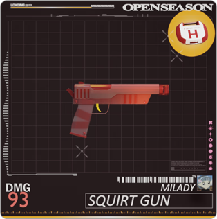

# Open Season

Play as Milady, Remilio or Bored Ape in this battle royale third-person shooter which takes place in the Island of JPEG. Explore the Apes’ Swamp or Milady Village in search of weapons and loot.

With three game modes to choose from, you can either chill shooting npc’s, kill your friends for points or enter into wager matches where the ultimate prize goes to the last man standing.

Currently in its alpha version, this is the first game produced by FU Studios. It is the blueprint for future productions and it showcases how an idea can be funded, built, monetized and distributed using the incentive structures developed by FU Studios.

After the first version of the game is out, the team plans to continuously expand the map, characters and gamemodes.

## Game Modes

### Quick

The game defaults to npc mode so players don’t have to wait in the lobby for others to join the server. The minimum amount of Game Points is allocated to this game mode.

### Normal

Players earn a percentage of game points when they kill an opponent and they lose a portion of points they have accumulated during the current match when they are killed.

### Wager

Users must wager a fixed amount to participate. Under all categories a 15% tax is collected. Last player standing keeps all the tokens minus taxes.
Wagering can be done in either $FUM or $ETH. In $FUM mode the taxes are burned while in $ETH mode it is sent to the treasury. Values in $FUM are calculated at a 100M Market Cap valuation and can be subject to change depending on market conditions.

> **Sardine** (~$1)
>
> 0.0005 ETH
>
> 6.2 FUM

> **Tuna** (~$100)
>
> 0.05 ETH
>
> 621 FUM

> **Whale** (~$10,000)
>
> 5 ETH
>
> 62,100 FUM

## Open Season Membership Types

Membership types help production teams finance and promote their creations. The following are the membership types helping finance Open Season.

- OG Membership
- OS NFT Upgrades
- OS Ambassador Membership

### OG Memberships

These were minted by individuals who helped the founding team build Open Season. These memberships are extremely exclusive and its holders should be blessed with fame, glory and infinite pleasures.

Benefits

- Early Access to all FU Studios productions
- Studio Passes Distribution
- OG Rare Weapons and Items
- $FUM Money Airdrop
- 5% of Open Season Wagering System

### Open Season NFT Upgrades

Each holder gains the ability to upgrade their NFT. Many single upgrades can unlock bigger upgrades adding more utility to the collection as a whole.

**Example**

Upgrade NFT Example with a 10,000 collection.
Price of the upgrade varies based on collection size.

**Individual**\
0.05 Ξ (~$100)\
Ability to mint Game Pass

**Basic Package** - 500 NFTs upgrade\
5% of the collection\
25 Ξ (~$50,000)\
Single character player and biome

|                       | **Mint Passes and Early Game Access** | **Single Character and Biome** |
| --------------------- | ------------------------------------- | ------------------------------ |
| **Upgrades Required** | 1                                     | 500                            |
| **Unit Price**        | 0.05 Ξ                                | 25 Ξ                           |

### Packages

Full offers that are sold as bundles.

> **Basic**\
> Development of a full detailed biome and one in-game character representing the NFT collection.

> **Deluxe**\
> The full collection as in-game characters, a detailed biome, early game access and unlimited Game Pass mints to all NFT holders.

|            | Game Passes | Early Game Access | Character  | Area  | Price |
| ---------- | ----------- | ----------------- | ---------- | ----- | ----- |
| **Deluxe** | Collection  | x                 | Collection | Biome | 40 Ξ  |
| **Basic**  | -           | -                 | Single     | Biome | 20 Ξ  |

### OS Ambassador Memberships

Offers for single individuals with a large following.

**Benefits**

- Early Game Access
- Mint Game Passes
- Personalized Avatars - Only the owner of the NFT would be able to use that particular avatar.

## Open Season Revenue Model

The revenue is converted to staked ETH and deposited in the treasury.

- Game Tournaments
- Wagering Systems
- Unique Characters
- Thematic Biomes
- Weapons, Items and Skins
- FU Ads

## Open Season Official Links

[Twitter](https://twitter.com/opunshizun)

[Website](https://openseason.games/)

[Epic Store](https://store.epicgames.com/en-US/p/openseason-75e993)
