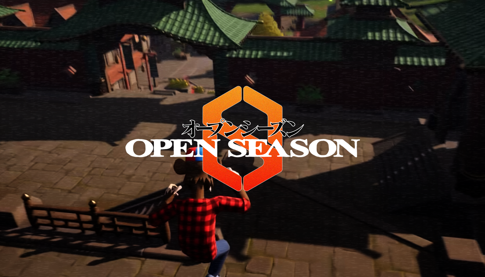
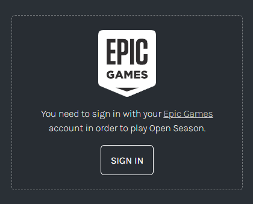
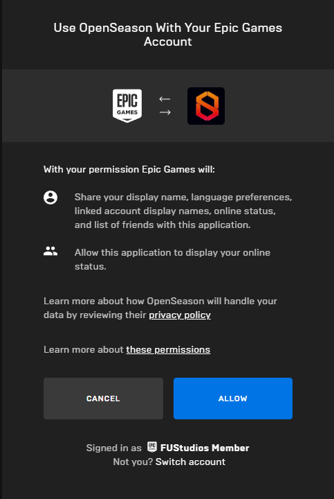
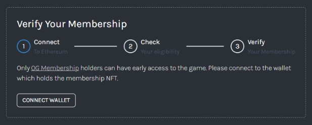
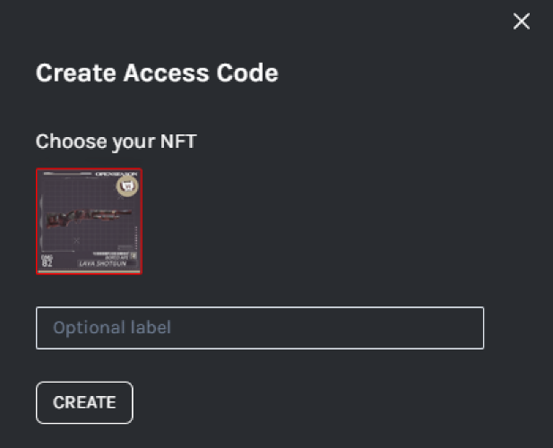
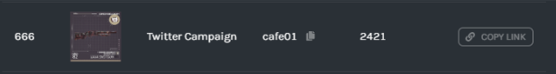
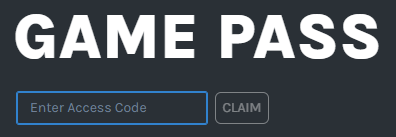

# Open Season

Play as Milady, Remilio or Bored Ape in this battle royale third-person shooter which takes place in the Island of JPEG. Explore the Apes’ Swamp or Milady Village in search of weapons and loot.

Currently in its alpha version, this is the first game produced by FU Studios. It is the blueprint for future productions and it showcases how an idea can be funded, built, monetized and distributed using the incentive structures developed by FU Studios.

### Battle Royale Gameplay

Players are dropped into a vast, dynamic battleground where they compete against each other for weapons and loot, until only one remains standing.

Whether you're a lone wolf or part of a team, the adrenaline-fueled action of Battle Royale promises an exhilirating gaming experience.

## Cost and Access

[FU Studio NFT](https://blur.io/collection/fustudiomembership) holders are the only ones able to play the early access (alpha / beta / pre-releases) version of the game.

Fully released versions of Open Season are **free to play**. Access to the game can be achieved by holding a **Game Pass**.

### Game Passes

The only way to mint a Game Pass is if you have an **Access Code**. Membership holders can create an unlimited amount of Access Codes on the [Open Season website](https://openseason.games/login). **Any Game Pass that is minted using an Access Code is bound to the Membership NFT that has created that Access Code.**

Access Codes are meant to be distributed through the web leveraging a membership holder’s social channels. If a user sells a FU Studio NFT, they are also selling the Access Code graph and all the Game Pass associations to that NFT. This means that the more Game Passes associated with an NFT, the more they should be worth, since a percentage of game earnings from the Game Passes are passed to the NFT associated with it.

In order to mint a Game Pass a user must also have an Epic account. Because Game Passes are associated with an Epic account a user does not need to hold a web3 wallet or even know about crypto in order to play Open Season.

To learn how you can get a Membership, distribute Access Codes or mint Game Passes check out our [explainer](#instructions).

_Access Codes will be fully functional after Beta._

### OpenSeason NFT Upgrades

Each holder gains the ability to [upgrade their NFT](https://openseason.games/collections). Many single upgrades can unlock bigger upgrades adding more utility to the collection as a whole.

After you have either acquired a Studio Membership or Upgraded NFT, head to the [Epic Store](https://store.epicgames.com/en-US/p/openseason-75e993) to get OpenSeason.

## How to add new in-game Avatars and Biomes

We offer NFT projects a unique partnership opportunity that strengthens brand recognition and rewards holders long term. If you'd like your NFT's to be in-game avatars, get in touch with us to discuss how to have your entire collection whitelisted.

Once whitelisted, you'll have a progress dashboard to see how many people in your community have purchased Upgraded NFT's. These are the same upgrades that allow users to play OpenSeason. Once your community upgrade fees reach 5 $ETH in total, we'll make an in-game avatar. Once they reach 25 $ETH, we'll make an in-game Biome based on lore and themes of your project.

If you upgrades fall short of the 2 goals and you want to close the gap manually, we'll allow it.

If you'd like to purchase any or all of the upgrades on behalf of your holders and distribute the ability to play OpenSeason to your community, we welcome that too!

|          | Upgraded NFT Per Unit | Avatar | Biome   |
| -------- | --------------------- | ------ | ------- |
| Upgrades | 1                     | 100    | 500     |
| Sum      | 0.05 $ETH             | 5 $ETH | 25 $ETH |

## Instructions

### Obtaining and verifying an NFT

FU Studios NFTs can be purchased on [SudoSwap](https://sudoswap.xyz/#/browse/buy/fustudiomembership), [Blur](https://blur.io/collection/fustudiomembership) or any NFT marketplace that supports the collection. Once you have the NFT, head to the Open Season website and [sign in](https://openseason.games/login) to your Epic Account.

Once signed in, simply connect to the wallet holding the NFT and verify it by following the required steps.

### How to create Access Codes

Access Codes can be created by any verified membership holder.
Go to [Access Codes](https://openseason.games/account/access-codes) after you are signed in.

Select the NFT in which the Access Code will reference. Any Game Pass created with this Access Code will be connected to this NFT.

Once created, simply copy and share the link to allow anyone to mint Game Passes and play Open Season for free.

### Game Pass Claim

After you signed in go to the [Game Pass page](https://openseason.games/account/game-pass) and simply enter a valid Access Code in the input field:

With a Game Pass you now have access to [play Open Season](https://store.epicgames.com/en-US/p/openseason-75e993)!

\*Only Game Passes created from FU Studios NFTs or Upgraded NFTs can currently access the early version of the game.

## Common Issues Connecting to the Game

If you are having issues connecting to the game, even though you have a connected NFT with a Game Pass, make sure to try the below methods to fix the problem

### Clear Game Cache

To clear the cache and reset the connected account for a specific game in the Epic Games Launcher, you'll need to delete the saved data and cache files related to that game. Here’s how you can do it:

### Step-by-Step Guide

#### 1. Close the Game and Epic Games Launcher

Make sure the game and the Epic Games Launcher are completely closed before you proceed.

#### 2. Locate the Game's Save and Cache Files

The location of these files may vary depending on the game. Here are some common locations:

- **Local App Data Folder:**

  - Press `Windows Key + R` to open the Run dialog box.
  - Type `%localappdata%` and press Enter.
  - Look for a folder with the name of the game or the game developer. For example, if the game is "OpenSeason," look for a folder named "OpenSeason" or similar.

- **Documents Folder:**
  - Some games store their save files in the Documents folder.
  - Navigate to `C:\Users\[Your Username]\Documents` and look for a folder with the game's name.

#### 3. Delete the Cache and Configuration Files

Once you've located the game's folder, you need to delete or rename specific files or folders to reset the connected account.

- **Example for OpenSeason:**
  - Navigate to `%localappdata%\OpenSeason\Saved`.
  - Delete the `Config` and `Logs` folders.

Look for similar folders such as `Config`, `Saved`, or `Logs`. Deleting these will reset the game's settings, including account data.

#### 4. Clear Epic Games Launcher Web Cache

This step ensures that any cached account information in the launcher is also cleared.

1. Open the Run dialog box by pressing `Windows Key + R`.
2. Type `%localappdata%` and press Enter.
3. Navigate to `EpicGamesLauncher\Saved`.
4. Delete the `webcache` folder.

#### 5. Restart Your Computer

After deleting the relevant files, restart your computer to ensure all changes take effect.

#### 6. Reopen the Epic Games Launcher and the Game

Open the Epic Games Launcher and launch the game. You should be prompted to log in or reconnect your account since the cache and saved account data have been cleared.

### Additional Tips

- **Backup Important Data:**
  Before deleting any files, consider backing up important data such as saved games or custom configurations.

By following these steps, you should be able to clear the cache and reset the connected account for a specific game in the Epic Games Launcher.

## Official Links

[Twitter](https://twitter.com/opunshizun)

[Discord](https://discord.com/invite/fxyyZCTaBS)

[Website](https://openseason.games/)

[Epic Store](https://store.epicgames.com/en-US/p/openseason-75e993)
